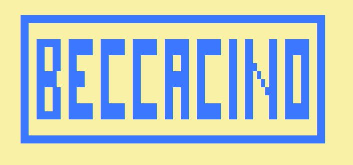
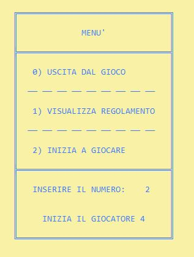
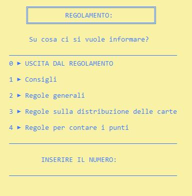
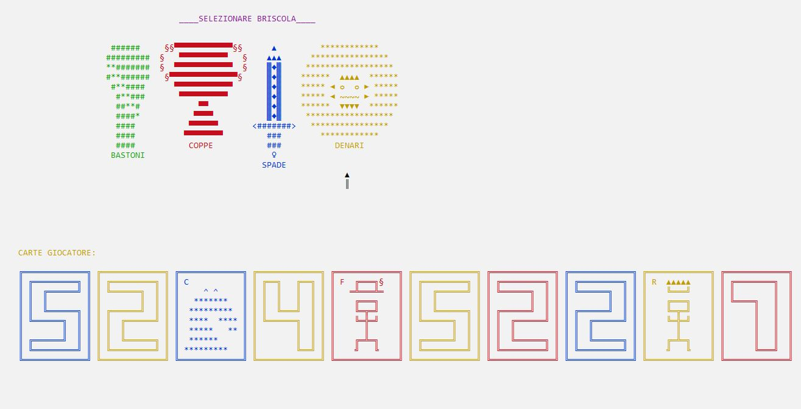
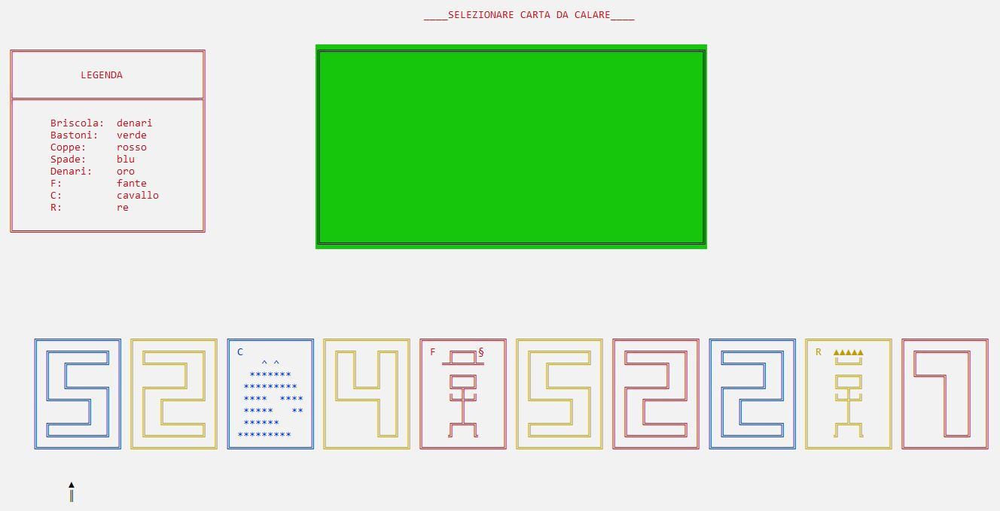
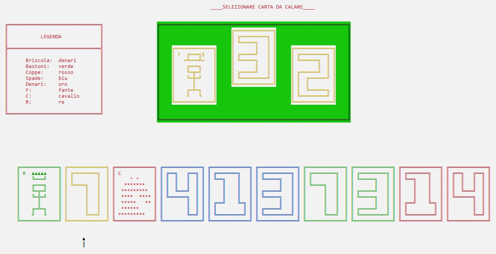
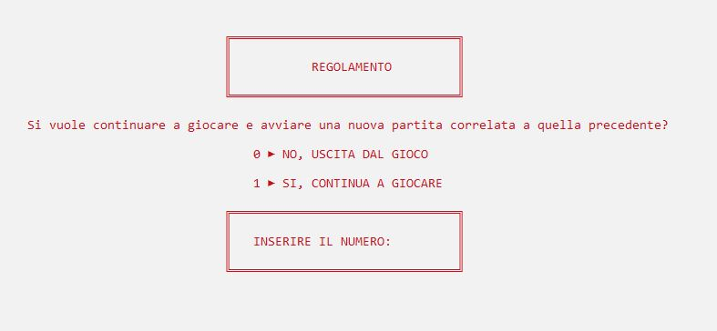
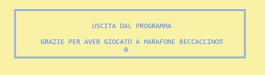

# 🃏 Progetto Gioco di Carte "Beccacino" (C++ CLI)

[](https://github.com/andreee5/Gioco_di_carte_Beccacino/releases/latest)


Simulazione testuale del gioco di carte tradizionale romagnolo **Beccacino**, sviluppata in linguaggio C++ con interfaccia testuale (CLI).

---

## 🧠 Descrizione del progetto

Progetto scolastico sviluppato durante il quarto anno di liceo scientifico, nato con l'obiettivo di simulare digitalmente il tradizionale gioco di carte romagnolo **Beccacino** (o Maraffone).  
Il gioco è stato realizzato in C++ con un'interfaccia testuale a colori tramite console.


### 🎮 Funzionalità principali del programma

All'avvio, l’utente visualizza un menù iniziale con tre opzioni:

1. **Gioca** – avvia una partita completa con altri 3 giocatori.
2. **Regolamento** – accede a un menù che spiega passo per passo le regole reali del gioco.
3. **Esci** – chiude il programma.

🔐 Durante la partita:
- Ogni giocatore vede **solo le proprie carte**.
- Le carte degli altri sono nascoste.
- Le carte sul tavolo **ruotano visivamente** per indicare il turno attivo.

🧩 Le regole implementate seguono fedelmente quelle del gioco reale:
- Si gioca in **4 giocatori** (2 contro 2).
- Si usa un **mazzo da 40 carte italiane** (coppe, denari, spade, bastoni).
- **Ordine di forza delle carte**: 3 > 2 > A > Re > Cavallo > Fante > 7 > 6 > 5 > 4
- La **briscola** viene selezionata dal giocatore che possiede il 4 di denari.
- Le prese vengono gestite in automatico, così come il calcolo dei punteggi.

🧱 Il codice è strutturato in modo modulare:
- Funzioni separate per ciascuna fase del gioco (distribuzione, regole, controllo turni, punteggi).
- Uso di funzioni grafiche su console: colori, posizionamento (`gotoxy`) e disegni ASCII.

---
## 🖼️ Screenshot

### 🎛️ Menù principale
Mostra le tre opzioni iniziali:
1. Gioca
2. Leggi il regolamento
3. Esci



---

### 📖 Menù regolamento
Visualizza, punto per punto, le regole ufficiali del Beccacino.



---

### 🂠 Scelta della briscola
Fase in cui viene chiesto al giocatore che possiede il 4 di denari di scegliere il seme di briscola per la partita.



---

### 🟢 Tavolo di gioco iniziale
Distribuzione delle carte, grafica testuale con sfondo verde e posizionamento delle carte.



---

### 🔄 Turno del giocatore attivo
Rotazione visiva delle carte e indicazione chiara del turno attuale.



---

### ❌ Uscita dal programma
Messaggio di chiusura controllato quando si seleziona l’opzione "Esci".




---

## 🛠️ Come compilare ed eseguire

### 1. Compilazione con terminale (g++)
Assicurati di avere `g++` installato (es. MinGW su Windows) e digita:

```bash
g++ -o beccaccino codice/Beccaccino.cpp
